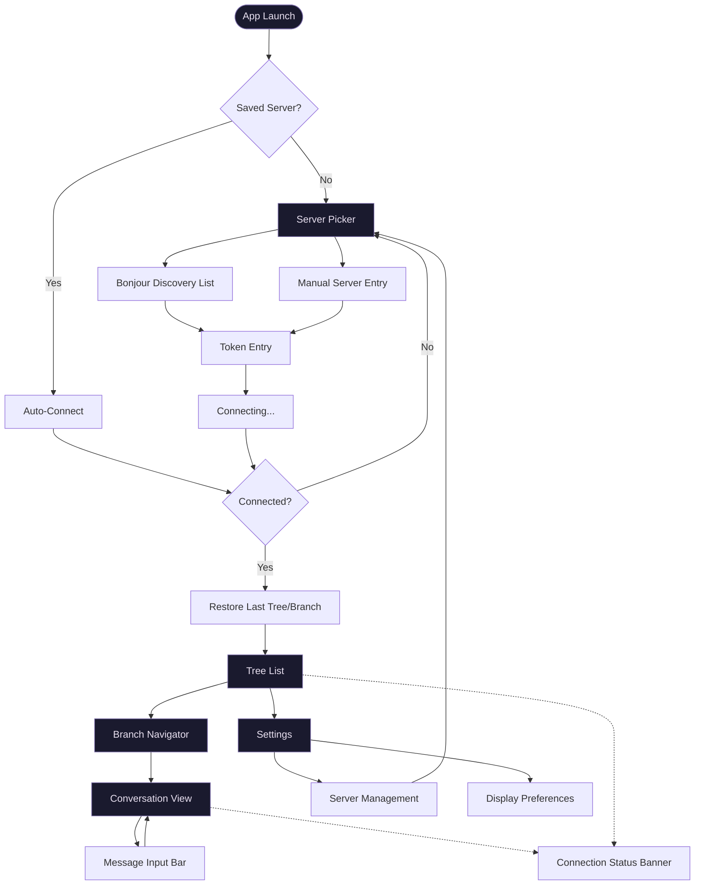

# World Tree Mobile — UI/UX Design Document

**Version:** 1.0
**Date:** 2026-02-22
**Author:** Lumen
**Status:** Draft
**Target:** iOS 17.0+ (iPhone), SwiftUI
**Design Priority:** Dark mode primary surface

---

## Table of Contents

1. [Design Philosophy](#1-design-philosophy)
2. [Information Architecture](#2-information-architecture)
3. [Screen Inventory](#3-screen-inventory)
4. [Design System](#4-design-system)
5. [Screen Designs](#5-screen-designs)
6. [Interaction Patterns](#6-interaction-patterns)
7. [Accessibility](#7-accessibility)
8. [View Audit Results](#8-view-audit-results)

---

## 1. Design Philosophy

World Tree Mobile is a remote terminal into a living conversation tree. The design serves one purpose: **make reading and contributing to AI conversations feel effortless on a phone.**

Dark mode is the primary surface. This is a developer tool used at night, on the couch, in bed — environments where a bright screen is hostile. Light mode exists for outdoor readability but is the secondary consideration.

**Principles:**

- **Content is everything.** The conversation is the product. Chrome exists to support it, never compete with it.
- **Warmth through color, not decoration.** A rich accent palette on a dark canvas creates personality without clutter.
- **Streaming is the feature.** Token-by-token rendering is the core experience. Every design decision protects its fluidity.
- **Readable at arm's length.** Generous type sizes, generous spacing, generous line heights. This is a reading app.
- **Quiet when idle, alive when streaming.** The UI breathes — subtle animations during activity, stillness during reading.

---

## 2. Information Architecture

### Screen Flow Diagram



### Navigation Model

```
NavigationStack (root)
  |
  +-- ServerPicker           (presented as full-screen if no server)
  |     +-- ManualEntrySheet (modal sheet, medium detent)
  |     +-- TokenEntrySheet  (modal sheet, medium detent)
  |
  +-- TreeList               (root view when connected)
  |     +-- BranchNavigator  (push from tree selection)
  |           +-- ConversationView (push from branch selection)
  |                 +-- InputBar (safeAreaInset, always visible)
  |
  +-- Settings               (push from TreeList toolbar)
        +-- ServerDetail     (push from server row)
        +-- Preferences      (inline in Settings)
```

---

## 3. Screen Inventory

| Screen | Purpose | Primary Action | Navigation | FRD Source |
|--------|---------|----------------|------------|------------|
| **Server Picker** | Connect to a World Tree server | Tap a discovered server to connect | Full-screen (first launch) or push (from Settings) | FRD-002, FRD-004 |
| **Token Entry** | Authenticate with server | Paste token and confirm | Modal sheet (medium detent) | FRD-007 |
| **Tree List** | Browse conversation trees | Tap a tree to view its branches | NavigationStack root (when connected) | FRD-005 |
| **Branch Navigator** | Switch between branches in a tree | Tap a branch to view its conversation | Push from Tree List | FRD-005 |
| **Conversation View** | Read messages and watch streaming responses | Read the latest message / send a new one | Push from Branch Navigator | FRD-005, FRD-006 |
| **Message Input Bar** | Compose and send messages | Tap send (or stop during streaming) | safeAreaInset on Conversation View | FRD-006 |
| **Settings** | Manage servers and preferences | Manage saved servers | Push from Tree List toolbar | FRD-004 |
| **Server Detail** | Edit a saved server's config | Edit server name / token / remove | Push from Settings | FRD-004, FRD-007 |
| **Connection Status** | Show connection state | Reconnect (when disconnected) | Banner overlay on Tree List / Conversation | FRD-004 |

---

## 4. Design System

### 4.1 Color Palette

All colors in OKLCH. Dark mode values are primary; light mode values follow.

#### Brand Colors

| Token | Role | Dark Mode (OKLCH) | Light Mode (OKLCH) | Hex Dark | Hex Light |
|-------|------|-------------------|--------------------|----------|-----------|
| `accent` | Primary interactive, send button, links | `oklch(0.72 0.14 280)` | `oklch(0.52 0.18 280)` | `#8B7AE8` | `#5B45C9` |
| `accentSubtle` | Accent at reduced prominence | `oklch(0.35 0.08 280)` | `oklch(0.92 0.04 280)` | `#3D3465` | `#E8E3F5` |
| `streaming` | Live streaming indicator, cursor pulse | `oklch(0.78 0.16 155)` | `oklch(0.50 0.16 155)` | `#4ADE80` | `#16A34A` |
| `warning` | Reconnecting states | `oklch(0.80 0.15 85)` | `oklch(0.55 0.15 85)` | `#FACC15` | `#CA8A04` |
| `error` | Disconnected, send failures | `oklch(0.65 0.20 25)` | `oklch(0.55 0.22 25)` | `#EF4444` | `#DC2626` |

#### Surface Colors

| Token | Role | Dark Mode (OKLCH) | Light Mode (OKLCH) | Hex Dark | Hex Light |
|-------|------|-------------------|--------------------|----------|-----------|
| `surfacePrimary` | App background | `oklch(0.15 0.01 280)` | `oklch(0.98 0.005 280)` | `#111118` | `#FAFAFE` |
| `surfaceSecondary` | Cards, grouped content | `oklch(0.20 0.015 280)` | `oklch(0.95 0.008 280)` | `#1A1A24` | `#F0F0F6` |
| `surfaceTertiary` | Nested content, code blocks | `oklch(0.25 0.02 280)` | `oklch(0.92 0.01 280)` | `#252530` | `#E8E8F0` |
| `surfaceElevated` | Input bar, sheets | `oklch(0.22 0.015 280)` | `oklch(0.97 0.005 280)` | `#1E1E2A` | `#F5F5FB` |

#### Message Bubble Colors

| Token | Role | Dark Mode (OKLCH) | Light Mode (OKLCH) | Hex Dark | Hex Light |
|-------|------|-------------------|--------------------|----------|-----------|
| `userBubble` | User message background | `oklch(0.40 0.10 280)` | `oklch(0.55 0.16 280)` | `#4A3F8A` | `#6B5BCF` |
| `userBubbleText` | User message text | `oklch(0.95 0.01 280)` | `oklch(0.98 0.005 280)` | `#F0EEF8` | `#FAFAFF` |
| `assistantBubble` | Assistant message background | `oklch(0.22 0.01 280)` | `oklch(0.95 0.005 280)` | `#1E1E28` | `#F2F2F8` |
| `assistantText` | Assistant message text | `oklch(0.90 0.01 280)` | `oklch(0.20 0.01 280)` | `#E0DDF0` | `#1C1C28` |

#### Text Colors

| Token | Role | Dark Mode (OKLCH) | Light Mode (OKLCH) | Hex Dark | Hex Light |
|-------|------|-------------------|--------------------|----------|-----------|
| `textPrimary` | Primary text | `oklch(0.93 0.01 280)` | `oklch(0.15 0.01 280)` | `#EDEBF5` | `#111118` |
| `textSecondary` | Secondary labels, timestamps | `oklch(0.65 0.02 280)` | `oklch(0.45 0.02 280)` | `#9690B0` | `#65608A` |
| `textTertiary` | Placeholder, disabled | `oklch(0.45 0.02 280)` | `oklch(0.65 0.02 280)` | `#5C5878` | `#9690B0` |
| `textOnAccent` | Text on accent backgrounds | `oklch(0.98 0.005 0)` | `oklch(0.98 0.005 0)` | `#FAFAFA` | `#FAFAFA` |

#### Semantic System Colors

Use SwiftUI semantic colors for system components (`.label`, `.secondaryLabel`, `.systemBackground`, etc.). The custom tokens above apply to app-specific surfaces and content.

### 4.2 Typography

**Display & UI:** SF Pro Rounded (via `.font(.system(.body, design: .rounded))`)
**Code blocks:** SF Mono (via `.font(.system(.body, design: .monospaced))`)

| Token | Style | Size (default) | Weight | Line Height | Use |
|-------|-------|----------------|--------|-------------|-----|
| `displayLarge` | Large Title | 34pt | Bold | 41pt | Server picker header |
| `displayMedium` | Title 1 | 28pt | Bold | 34pt | Tree name (detail) |
| `heading` | Title 3 | 20pt | Semibold | 25pt | Section headings |
| `headingSmall` | Headline | 17pt | Semibold | 22pt | List row titles, branch names |
| `body` | Body | 17pt | Regular | 22pt | Message text (default) |
| `bodySmall` | Callout | 16pt | Regular | 21pt | Secondary message content |
| `caption` | Subheadline | 15pt | Regular | 20pt | Timestamps, metadata |
| `captionSmall` | Footnote | 13pt | Regular | 18pt | Connection status, token counts |
| `code` | Monospaced Body | 15pt | Regular | 20pt | Code blocks, inline code |
| `codeSmall` | Monospaced Footnote | 13pt | Regular | 18pt | Tool status chips |

**Implementation:** Always use SwiftUI text styles (`.font(.title3)`) for automatic Dynamic Type. Apply `.fontDesign(.rounded)` at the app level for display text. Code blocks explicitly use `.fontDesign(.monospaced)`.

### 4.3 Spacing Tokens

Based on 4pt grid, following the 8pt system.

| Token | Value | Use |
|-------|-------|-----|
| `xxs` | 2pt | Inline icon-to-text gap |
| `xs` | 4pt | Tight spacing within components |
| `sm` | 8pt | Intra-component padding |
| `md` | 12pt | Standard component padding |
| `lg` | 16pt | Standard view padding, message gap |
| `xl` | 24pt | Section spacing |
| `xxl` | 32pt | Major section breaks |
| `xxxl` | 48pt | Screen-level vertical rhythm |

**Message-specific spacing:**

| Token | Value | Use |
|-------|-------|-----|
| `messageBubblePadding` | 14pt | Padding inside message bubbles |
| `messageGap` | 8pt | Between consecutive same-role messages |
| `messageGroupGap` | 16pt | Between user and assistant message groups |
| `inputBarPadding` | 12pt | Input bar internal padding |
| `inputBarTopBorder` | 0.5pt | Hairline separator above input bar |

### 4.4 Corner Radii

| Token | Value | Use |
|-------|-------|-----|
| `sm` | 8pt | Small chips, badges, tool status |
| `md` | 12pt | Message bubbles, code blocks |
| `lg` | 16pt | Cards, input field |
| `xl` | 20pt | Sheets, large containers |
| `full` | 9999pt | Circular buttons (send/stop) |

All corners use continuous curvature (`.continuous` corner style).

### 4.5 Shadows & Elevation

Two levels only (shadow restraint rule):

| Level | Use | Dark Mode | Light Mode |
|-------|-----|-----------|------------|
| `none` | Default. Flat content. | — | — |
| `elevated` | Input bar, floating action button | `0 -1 4 rgba(0,0,0,0.3)` | `0 -1 4 rgba(0,0,0,0.08)` |

No decorative shadows. Elevation is communicated primarily through surface color difference, not shadow.

### 4.6 Iconography

SF Symbols throughout. Rounded weight to match SF Pro Rounded.

| Context | Symbol | Rendering |
|---------|--------|-----------|
| Send message | `arrow.up.circle.fill` | Monochrome, accent |
| Stop streaming | `stop.circle.fill` | Monochrome, error |
| Scroll to bottom | `chevron.down.circle.fill` | Monochrome, accent |
| Tree (conversation) | `text.bubble` | Hierarchical |
| Branch | `arrow.triangle.branch` | Hierarchical |
| Streaming live | `circle.fill` | Monochrome, streaming (pulsing) |
| Connected | `wifi` | Monochrome, streaming |
| Reconnecting | `arrow.triangle.2.circlepath` | Monochrome, warning |
| Disconnected | `wifi.slash` | Monochrome, error |
| Settings | `gearshape` | Monochrome |
| Server (local) | `desktopcomputer` | Hierarchical |
| Server (Tailscale) | `globe` | Hierarchical |
| Add server | `plus` | Monochrome |
| Token (secure) | `key.fill` | Monochrome |
| Copy code | `doc.on.doc` | Monochrome |
| Tool running | `gearshape.2` | Monochrome, textSecondary |
| Retry | `arrow.clockwise` | Monochrome, accent |
| Pull to refresh | System default | — |
| Back navigation | System default | — |

---

## 5. Screen Designs

### 5.1 Server Picker

#### Five Questions

1. **What is this screen FOR?** Connect the iPhone to a World Tree server.
2. **What is the user's primary action?** Tap a discovered server to initiate connection.
3. **What information does the user need?** Server name, connection type (Local/Tailscale), availability status.
4. **What would confuse a new user within 3 seconds?** Seeing Bonjour and Tailscale as separate concepts. Solution: unified list, connection type shown as a subtle badge.
5. **What can be removed?** IP addresses in the main list. Show only server name and type. IP visible in detail/edit.

#### Layout Specification

```
+------------------------------------------+
|  status bar                              |
|                                          |
|  World Tree              [+] (add manual)|
|  (Large Title, rounded)                  |
|                                          |
|  ┌──────────────────────────────────────┐|
|  │  NEARBY SERVERS (section header)     │|
|  │                                      │|
|  │  ┌────────────────────────────────┐  │|
|  │  │  🖥 Ryan's MacBook Pro         │  │|
|  │  │  Local · Last connected 2m ago │  │|
|  │  │                          [>]   │  │|
|  │  └────────────────────────────────┘  │|
|  │                                      │|
|  │  ┌────────────────────────────────┐  │|
|  │  │  🖥 Office iMac                │  │|
|  │  │  Local · Never connected       │  │|
|  │  │                          [>]   │  │|
|  │  └────────────────────────────────┘  │|
|  │                                      │|
|  │  SAVED SERVERS (section header)      │|
|  │                                      │|
|  │  ┌────────────────────────────────┐  │|
|  │  │  🌐 ryans-mac.tailnet          │  │|
|  │  │  Tailscale · Connected 1h ago  │  │|
|  │  │                          [>]   │  │|
|  │  └────────────────────────────────┘  │|
|  │                                      │|
|  └──────────────────────────────────────┘|
|                                          |
|  If no servers found:                    |
|  "Looking for World Tree servers..."     |
|  [scanning animation]                    |
|  "Make sure World Tree is running on     |
|   your Mac and both devices are on       |
|   the same network."                     |
|                                          |
|  [Add Server Manually] (borderless btn)  |
+------------------------------------------+
```

**Navigation:** Full-screen on first launch (no back button). Push from Settings thereafter.

**Component Details:**

- **Server rows:** `surfaceSecondary` background, `md` corner radius, `lg` padding. Icon leading (desktopcomputer for local, globe for Tailscale). Name in `headingSmall`, metadata in `caption` + `textSecondary`.
- **Section headers:** `captionSmall` weight semibold, `textTertiary`, uppercase, `xl` top padding.
- **Add button:** `+` in navigation bar trailing. Presents Manual Entry sheet.
- **Empty state:** Centered vertically. Scanning animation is a pulsing ring (3 concentric circles, staggered fade). Instruction text in `bodySmall`, `textSecondary`. "Add Server Manually" as borderless button.
- **Bonjour scanning:** Begins immediately on appear. `NWBrowser` results update the list in real time.

**Tap behavior:** Tapping a server that has a stored token initiates connection immediately. Tapping a server without a token presents the Token Entry sheet.

#### Manual Server Entry (Modal Sheet)

```
+------------------------------------------+
|  [Cancel]   Add Server         [Save]    |
|  ─────────────────────────────────────── |
|                                          |
|  Server Address                          |
|  ┌────────────────────────────────────┐  |
|  │  hostname-or-ip:5865              │  |
|  └────────────────────────────────────┘  |
|                                          |
|  Display Name (optional)                 |
|  ┌────────────────────────────────────┐  |
|  │  My Mac (Tailscale)               │  |
|  └────────────────────────────────────┘  |
|                                          |
|  Server Token                            |
|  ┌────────────────────────────────────┐  |
|  │  ●●●●●●●●●●●●●●●●●●●●  [Paste]  │  |
|  └────────────────────────────────────┘  |
|                                          |
|  Find this token in World Tree on your   |
|  Mac: Settings > Server > Token.         |
|                                          |
+------------------------------------------+
```

**Detent:** Medium (expandable to large if keyboard pushes content).
**Save button:** Disabled until address and token are non-empty. `.borderedProminent` style.

### 5.2 Token Entry (for Bonjour-discovered servers)

#### Five Questions

1. **What is this screen FOR?** Authenticate with a discovered server for the first time.
2. **What is the user's primary action?** Paste the auth token and connect.
3. **What information does the user need?** Which server they are connecting to, where to find the token.
4. **What would confuse a new user within 3 seconds?** Not knowing what a "token" is or where to find it.
5. **What can be removed?** Anything beyond the token field, the server name, and one line of instruction.

#### Layout Specification

```
+------------------------------------------+
|  [Cancel]   Connect         [Connect]    |
|  ─────────────────────────────────────── |
|                                          |
|  🖥  Ryan's MacBook Pro                  |
|  Local · 192.168.1.42:5865              |
|                                          |
|  Server Token                            |
|  ┌────────────────────────────────────┐  |
|  │  ●●●●●●●●●●●●●●●●●●●●  [Paste]  │  |
|  └────────────────────────────────────┘  |
|                                          |
|  On your Mac, open World Tree >          |
|  Settings > Server > Copy Token.         |
|                                          |
+------------------------------------------+
```

**Detent:** Medium. Non-expandable.
**Connect button:** `.borderedProminent`, disabled until token is non-empty.

### 5.3 Tree List

#### Five Questions

1. **What is this screen FOR?** Browse and select a conversation tree.
2. **What is the user's primary action?** Tap a tree to see its branches.
3. **What information does the user need?** Tree name, recency, message count, whether it is actively streaming.
4. **What would confuse a new user within 3 seconds?** Nothing — it is a list. Keep it simple.
5. **What can be removed?** Project name is low-value on mobile. Show it only if non-nil, as a subtle badge.

#### Layout Specification

```
+------------------------------------------+
|  status bar                              |
|                                          |
|  Conversations    [wifi icon] [gear]     |
|  (Large Title, rounded)                  |
|                                          |
|  pull-to-refresh zone                    |
|                                          |
|  ┌────────────────────────────────────┐  |
|  │  ● Claude Opus conversation        │  |
|  │    142 messages · 3 min ago        │  |
|  │                             [>]    │  |
|  └────────────────────────────────────┘  |
|                                          |
|  ┌────────────────────────────────────┐  |
|  │    openClaude Architecture         │  |
|  │    89 messages · 2 hours ago       │  |
|  │    #openClaude                     │  |
|  │                             [>]    │  |
|  └────────────────────────────────────┘  |
|                                          |
|  ┌────────────────────────────────────┐  |
|  │    World Tree Mobile Planning      │  |
|  │    34 messages · Yesterday         │  |
|  │                             [>]    │  |
|  └────────────────────────────────────┘  |
|                                          |
|  ... (scrollable)                        |
|                                          |
|  Empty state:                            |
|  "No conversations yet."                |
|  "Start a conversation in World Tree    |
|   on your Mac."                          |
+------------------------------------------+
```

**Navigation:** NavigationStack root when connected. Toolbar leading: connection status icon. Toolbar trailing: Settings gear.

**Component Details:**

- **Tree rows:** Grouped list style (`.insetGrouped`). Name in `headingSmall`. Metadata line: message count + relative time in `caption`, `textSecondary`. Project tag in `captionSmall`, `accentSubtle` background pill if present.
- **Live indicator:** Green dot (`streaming` color) to the left of tree name, pulsing animation. VoiceOver: "streaming" appended to label.
- **Connection status icon:** `wifi` (green) / `arrow.triangle.2.circlepath` (yellow, spinning) / `wifi.slash` (red) in navigation bar leading. Tappable — shows connection detail popover.
- **Pull-to-refresh:** Standard SwiftUI `.refreshable`. Sends `list_trees` request.
- **Sorted:** `updatedAt` descending. Trees with active streaming float to top.

### 5.4 Branch Navigator

#### Five Questions

1. **What is this screen FOR?** Select a branch within a conversation tree.
2. **What is the user's primary action?** Tap a branch to view its messages.
3. **What information does the user need?** Branch name, message count, which branch is active/current.
4. **What would confuse a new user within 3 seconds?** What a "branch" is. Solution: show a brief header explaining the tree metaphor if more than one branch exists.
5. **What can be removed?** Fork-point details. Most users care about the branch name and recency. Fork info available in a future detail view.

#### Layout Specification

```
+------------------------------------------+
|  [< Conversations]   Tree Name           |
|                       (inline title)     |
|                                          |
|  If single branch: skip this screen,     |
|  navigate directly to ConversationView.  |
|                                          |
|  BRANCHES (section header)               |
|                                          |
|  ┌────────────────────────────────────┐  |
|  │  ● main                    ✓      │  |
|  │    67 messages                     │  |
|  └────────────────────────────────────┘  |
|                                          |
|  ┌────────────────────────────────────┐  |
|  │    refactor-attempt                │  |
|  │    23 messages · branched from #12 │  |
|  └────────────────────────────────────┘  |
|                                          |
|  ┌────────────────────────────────────┐  |
|  │    with-tests                      │  |
|  │    45 messages · branched from #30 │  |
|  └────────────────────────────────────┘  |
|                                          |
+------------------------------------------+
```

**Navigation:** Push from Tree List. If only one branch exists, skip directly to Conversation View (auto-select the single branch).

**Component Details:**

- **Active branch indicator:** Checkmark trailing in `accent` color. Row has `accentSubtle` background tint.
- **Branch rows:** Grouped list style. Name in `headingSmall`. Metadata in `caption`, `textSecondary`.
- **Streaming indicator:** Same green pulsing dot as tree list, shown on the branch that is actively streaming.
- **Inline title:** Tree name as `.navigationBarTitleDisplayMode(.inline)`.

### 5.5 Conversation View

#### Five Questions

1. **What is this screen FOR?** Read a conversation and watch responses stream in real time.
2. **What is the user's primary action?** Read the latest message (passive) or send a new message (active).
3. **What information does the user need?** Messages in order, who said what, whether the assistant is currently responding.
4. **What would confuse a new user within 3 seconds?** Nothing, if the message layout is clear. Role distinction must be immediate.
5. **What can be removed?** Individual message timestamps (show time groups instead). Avatar images (role is communicated by alignment and color).

#### Layout Specification

```
+------------------------------------------+
|  [< branch-name]    Tree Name            |
|  ─────────────────────────────────────── |
|                                          |
|  ┌── scroll view ─────────────────────┐  |
|  │                                    │  |
|  │         Today, 2:30 PM            │  |
|  │         (time divider)            │  |
|  │                                    │  |
|  │               ┌──────────────────┐ │  |
|  │               │ Explain the tree │ │  |
|  │               │ data structure   │ │  |
|  │               │ in World Tree    │ │  |
|  │               └──────────────────┘ │  |
|  │                        (user msg)  │  |
|  │                                    │  |
|  │  ┌──────────────────────────────┐  │  |
|  │  │ World Tree uses a branching  │  │  |
|  │  │ conversation model where...  │  │  |
|  │  │                              │  │  |
|  │  │ ```swift                     │  │  |
|  │  │ struct Branch {              │  │  |
|  │  │   let id: UUID              │  │  |
|  │  │   var messages: [Message]   │  │  |
|  │  │ }                           │  │  |
|  │  │ ```              [copy]     │  │  |
|  │  │                              │  │  |
|  │  │ Each branch maintains its    │  │  |
|  │  │ own message history while... │  │  |
|  │  └──────────────────────────────┘  │  |
|  │  (assistant msg)                   │  |
|  │                                    │  |
|  │  ┌──────────────────────────────┐  │  |
|  │  │  ⚙ Running: search_files    │  │  |
|  │  └──────────────────────────────┘  │  |
|  │  (tool status chip)                │  |
|  │                                    │  |
|  │  ┌──────────────────────────────┐  │  |
|  │  │  Based on the search, here  │  │  |
|  │  │  are the relevant files...  │  │  |
|  │  │  █ (blinking cursor)        │  │  |
|  │  └──────────────────────────────┘  │  |
|  │  (streaming message)               │  |
|  │                                    │  |
|  └────────────────────────────────────┘  |
|                                          |
|      [v] scroll-to-bottom FAB            |
|                                          |
|  ┌────────────────────────────────────┐  |
|  │  Message branch-name...   [send]  │  |
|  └────────────────────────────────────┘  |
|  (input bar, above keyboard)             |
+------------------------------------------+
```

**Navigation:** Push from Branch Navigator. Inline title shows tree name. Back button shows branch name.

**Component Details:**

##### Message Layout

- **User messages:** Right-aligned. `userBubble` background. `userBubbleText` foreground. Max width 85% of screen. `md` corner radius. `messageBubblePadding` internal. Text in `body`, rounded design.
- **Assistant messages:** Left-aligned, full width (no bubble — open layout for readability). `assistantText` foreground on `surfacePrimary` background. `lg` horizontal padding. Text in `body`, rounded design.
- **System messages:** Centered. `textTertiary` color. `captionSmall` size. Horizontal rule above and below (1px `surfaceTertiary`).
- **Time dividers:** Centered. `captionSmall`, `textTertiary`. Shown when 30+ minutes separate consecutive messages.

##### Streaming Message

- **Identical layout to assistant messages** but with a blinking cursor at the end of the text.
- **Cursor:** `|` character in `accent` color, blinking at 1Hz (0.5s on, 0.5s off). Respects Reduce Motion (static cursor).
- **Streaming indicator:** Small `streaming` color dot next to the branch name in the nav bar, pulsing.

##### Code Blocks

- **Background:** `surfaceTertiary`.
- **Font:** `code` token (SF Mono).
- **Corner radius:** `md`.
- **Padding:** `md` all sides.
- **Horizontal scroll:** Enabled. No line wrapping.
- **Copy button:** Top-trailing corner, `doc.on.doc` icon, borderless, `textSecondary`. Tap copies to clipboard with brief "Copied" toast.
- **Language label:** Top-leading, `captionSmall`, `textTertiary` (if language specified in markdown).

##### Tool Status Chips

- **Layout:** Inline, full width, centered text.
- **Background:** `surfaceTertiary`.
- **Corner radius:** `sm`.
- **Icon:** `gearshape.2` leading, spinning while status is `started`.
- **Text:** "[Running: tool_name]" during execution. "[Done: tool_name]" on completion. `codeSmall` size, `textSecondary`.
- **Transition:** Fade from "Running" to "Done" (0.3s).

##### Scroll-to-Bottom FAB

- **Position:** Trailing, 16pt above input bar.
- **Appearance:** `chevron.down.circle.fill`, 40pt diameter, `accent` tint, `elevated` shadow.
- **Visibility:** Hidden when within 100pt of bottom. Shown with fade+scale animation when scrolled up and new content arrives. Badge with unread message count if multiple new messages.
- **Tap:** Scrolls to bottom with animation.

##### Pagination

- **Scroll to top** triggers loading indicator and fetches previous 50 messages.
- **Loading indicator:** Standard `ProgressView` centered at top of scroll view.
- **Loaded messages** are prepended without jumping scroll position (maintain content offset).

### 5.6 Message Input Bar

#### Five Questions

1. **What is this screen FOR?** Compose and send a message to the current branch.
2. **What is the user's primary action?** Tap send.
3. **What information does the user need?** Which branch they are writing to (placeholder), whether the system is ready to receive (send vs stop state).
4. **What would confuse a new user within 3 seconds?** Nothing. It is a text field with a send button.
5. **What can be removed?** Attachment buttons, formatting toolbar. Text and send is all.

#### Layout Specification

```
+------------------------------------------+
|  hairline separator (surfaceTertiary)    |
|  ┌────────────────────────────────────┐  |
|  │                                    │  |
|  │  ┌──────────────────────┐  ┌───┐  │  |
|  │  │ Message branch-name  │  │ ↑ │  │  |
|  │  │                      │  └───┘  │  |
|  │  └──────────────────────┘         │  |
|  │                                    │  |
|  └────────────────────────────────────┘  |
|  keyboard                                |
```

**Component Details:**

- **Background:** `surfaceElevated`. `elevated` shadow (upward, subtle).
- **Text field:** Multi-line `TextField` or `TextEditor`. `surfaceTertiary` background. `lg` corner radius. `md` internal padding. Placeholder: "Message {branchName}..." in `textTertiary`. Grows to 5 lines, then scrolls internally. `body` font, rounded design.
- **Send button:** `arrow.up.circle.fill`, 36pt, `accent` fill when enabled, `textTertiary` fill when disabled. Positioned trailing, vertically centered to text field. 44pt touch target minimum.
- **Stop button:** Replaces send when streaming. `stop.circle.fill`, 36pt, `error` color. Same position.
- **Send/Stop transition:** Cross-dissolve (0.2s).
- **Keyboard avoidance:** Input bar uses `.safeAreaInset(edge: .bottom)`. Scroll view adjusts automatically. Keyboard dismiss: `.scrollDismissesKeyboard(.interactively)` on message list.

**States:**

| State | Send Button | Text Field |
|-------|-------------|------------|
| Empty + idle | Disabled (muted) | Editable, placeholder visible |
| Has text + idle | Enabled (accent) | Editable |
| Streaming | Stop button (error) | Editable (draft preserved) |
| Disconnected | Disabled (muted) | Editable (draft preserved) |
| Send failed | Enabled (accent) | Editable (text restored) |

### 5.7 Settings

#### Five Questions

1. **What is this screen FOR?** Manage server connections and display preferences.
2. **What is the user's primary action?** Manage servers (add, edit, remove).
3. **What information does the user need?** List of saved servers with status, current display settings.
4. **What would confuse a new user within 3 seconds?** Nothing. Standard settings layout.
5. **What can be removed?** Advanced networking details. Keep it to essentials.

#### Layout Specification

```
+------------------------------------------+
|  [< Conversations]     Settings          |
|                        (inline title)    |
|                                          |
|  SERVERS (section header)                |
|                                          |
|  ┌────────────────────────────────────┐  |
|  │  ● Ryan's MacBook Pro    Connected│  |
|  │    Local · 192.168.1.42:5865      │  |
|  │                             [>]   │  |
|  └────────────────────────────────────┘  |
|  ┌────────────────────────────────────┐  |
|  │    ryans-mac.tailnet              │  |
|  │    Tailscale · Disconnected       │  |
|  │                             [>]   │  |
|  └────────────────────────────────────┘  |
|  ┌────────────────────────────────────┐  |
|  │  [+] Add Server                   │  |
|  └────────────────────────────────────┘  |
|                                          |
|  CONNECTION (section header)             |
|                                          |
|  ┌────────────────────────────────────┐  |
|  │  Auto-Connect            [toggle] │  |
|  │  Connect to last server on launch │  |
|  └────────────────────────────────────┘  |
|                                          |
|  DISPLAY (section header)                |
|                                          |
|  ┌────────────────────────────────────┐  |
|  │  Message Font Size                │  |
|  │  [A]────●─────────────────[A]     │  |
|  │  (slider, small to large)         │  |
|  └────────────────────────────────────┘  |
|                                          |
|  ABOUT (section header)                  |
|                                          |
|  ┌────────────────────────────────────┐  |
|  │  Version          1.0 (42)        │  |
|  │  Server Protocol  v1              │  |
|  └────────────────────────────────────┘  |
|                                          |
+------------------------------------------+
```

**Navigation:** Push from Tree List toolbar (gear icon).

**Component Details:**

- **Server rows:** Green dot for connected, no dot for disconnected. Status text in `captionSmall`. Tapping navigates to Server Detail (push).
- **Add Server:** Borderless button with `+` icon. Navigates to Server Picker.
- **Auto-Connect toggle:** Standard SwiftUI `Toggle`.
- **Font size slider:** Custom slider with small "A" and large "A" labels at endpoints. Updates message preview in real time.
- **About section:** Read-only info rows.
- **List style:** `.insetGrouped`.

### 5.8 Server Detail

#### Five Questions

1. **What is this screen FOR?** View and edit a saved server's configuration.
2. **What is the user's primary action?** Connect to this server (or edit its details).
3. **What information does the user need?** Server name, address, connection type, token status, current connection state.
4. **What would confuse a new user within 3 seconds?** Nothing. Standard detail view.
5. **What can be removed?** Log details, advanced networking.

#### Layout Specification

```
+------------------------------------------+
|  [< Settings]      Server Name           |
|                     (inline title)       |
|                                          |
|  STATUS (section header)                 |
|                                          |
|  ┌────────────────────────────────────┐  |
|  │  Connection     Connected (24ms)  │  |
|  │  Address        192.168.1.42:5865 │  |
|  │  Type           Local (Bonjour)   │  |
|  │  Protocol       v1               │  |
|  └────────────────────────────────────┘  |
|                                          |
|  CONFIGURATION (section header)          |
|                                          |
|  ┌────────────────────────────────────┐  |
|  │  Display Name                     │  |
|  │  [Ryan's MacBook Pro            ] │  |
|  │                                    │  |
|  │  Address                          │  |
|  │  [192.168.1.42:5865             ] │  |
|  │                                    │  |
|  │  Token                            │  |
|  │  [●●●●●●●●●●●●●●●●  ] [Change]  │  |
|  └────────────────────────────────────┘  |
|                                          |
|  ┌────────────────────────────────────┐  |
|  │       [Connect] / [Disconnect]    │  |
|  │       (.borderedProminent)        │  |
|  └────────────────────────────────────┘  |
|                                          |
|  ┌────────────────────────────────────┐  |
|  │       [Remove Server]             │  |
|  │       (.destructive, plain)       │  |
|  └────────────────────────────────────┘  |
|                                          |
+------------------------------------------+
```

**Navigation:** Push from Settings server row.

**Component Details:**

- **Status section:** Read-only rows showing live connection info. Latency shown in parentheses when connected.
- **Configuration section:** Editable fields. Address is read-only for Bonjour-discovered servers. Token shows masked dots with a "Change" button.
- **Connect/Disconnect:** Single `.borderedProminent` button. Label changes based on connection state. This is the primary action.
- **Remove Server:** `.plain` style with `.destructive` role. Confirmation alert before removal.

### 5.9 Connection Status Banner

#### Five Questions

1. **What is this screen FOR?** Communicate connection state changes non-intrusively.
2. **What is the user's primary action?** Tap to reconnect (when disconnected).
3. **What information does the user need?** What is happening (reconnecting? disconnected?) and what to do about it.
4. **What would confuse a new user within 3 seconds?** Technical error codes. Solution: plain language.
5. **What can be removed?** Retry count, IP addresses, error codes.

#### States and Appearance

| State | Banner | Color | Action |
|-------|--------|-------|--------|
| Connected | Hidden | — | — |
| Connecting | "Connecting..." | `surfaceSecondary` | None (auto) |
| Reconnecting | "Reconnecting..." | `warning` at 15% opacity | None (auto) |
| Disconnected | "Disconnected. Tap to reconnect." | `error` at 15% opacity | Tap to retry |
| Auth failed | "Authentication failed. Check token in Settings." | `error` at 15% opacity | Tap opens Settings |

**Layout:**

- **Position:** Below navigation bar, above content. Pushes content down (does not overlay).
- **Height:** 44pt (touch target compliant when tappable).
- **Text:** `captionSmall`, centered, `textPrimary`.
- **Icon:** Leading — spinning `arrow.triangle.2.circlepath` (reconnecting) or static `wifi.slash` (disconnected).
- **Animation:** Slide down from nav bar (0.3s spring). Slide up to dismiss (0.25s).
- **Auto-dismiss:** Connected state banners dismiss automatically. Disconnected banners persist until action.

---

## 6. Interaction Patterns

### 6.1 Streaming Text Rendering

The core experience. Tokens must render smoothly at 60fps.

**Architecture: CADisplayLink Batching (recommended in FRD-005)**

```
Token arrives via WebSocket
  |
  v
Accumulate in buffer (off-main-thread safe)
  |
  v
CADisplayLink fires (~60Hz)
  |
  v
Flush buffer: append all accumulated tokens to streaming text
  |
  v
SwiftUI re-renders streaming message view
  |
  v
Markdown rendering:
  - Completed paragraphs: full AttributedString markdown
  - Current paragraph (last line): plain text append (fast)
  - Re-render current paragraph on newline
```

**Performance Targets:**
- First token visible within 1 frame (16.6ms) of WebSocket receipt
- No dropped frames at 100+ tokens/second
- Memory: streaming text buffer capped at 50KB before flushing to completed message

**Visual Behavior:**
- Text appears character by character (or chunk by chunk from LLM)
- No animation on individual characters (appear instantly at cursor position)
- Blinking cursor follows last character
- Scroll view tracks bottom during streaming (auto-scroll engaged)
- Code blocks render inline as they form (backtick detection)

**Markdown Rendering Strategy:**
- During streaming: render completed blocks (paragraphs, code blocks, lists) as markdown. Render the in-progress line as plain text.
- On `message_complete`: re-render entire message as full markdown (single pass).
- This prevents partial-markdown parsing errors (e.g., unclosed code blocks mid-stream).

### 6.2 Auto-Scroll Behavior

```
User scrolled position:
  |
  ├── Within 100pt of bottom → auto-scroll ENGAGED
  │   └── New token arrives → scroll to bottom (animated, 0.1s)
  |
  └── More than 100pt above bottom → auto-scroll DISENGAGED
      └── New token arrives → do NOT scroll
      └── Show "scroll to bottom" FAB
      └── FAB badge shows count of new messages since disengage
```

**Edge Cases:**
- User scrolls up during streaming → auto-scroll disengages, FAB appears, streaming continues off-screen
- User taps FAB → scroll to bottom, auto-scroll re-engages, FAB hides
- User sends a message → force scroll to bottom, re-engage auto-scroll
- Keyboard appears → maintain relative scroll position (if at bottom, stay at bottom)

### 6.3 Send Message Flow

```
User taps Send
  |
  +-- Immediately: display user message in list (optimistic)
  +-- Immediately: clear input field
  +-- Immediately: scroll to bottom
  +-- Immediately: send WebSocket message
  |
  v
Wait for server response
  |
  ├── Tokens start arriving → streaming begins (send button → stop button)
  ├── Error response → user message shows error badge, input text restored
  └── Branch busy → toast: "Waiting for current response to finish"
```

**Optimistic UI Details:**
- User message appears with no special indicator (confidence: message will arrive)
- If send fails, the message gains a red exclamation icon and "Tap to retry" caption
- On retry, the message re-sends. On success, error state clears.
- If user navigates away from branch and comes back, failed messages are gone (they were never persisted server-side)

### 6.4 Stop/Cancel Streaming

```
User taps Stop (replaces Send during streaming)
  |
  +-- Send cancel_stream WebSocket message
  +-- Immediately: stop button → disabled (briefly)
  |
  v
Server responds
  |
  ├── message_complete with partial content → streaming ends, partial message shown
  └── Streaming ends naturally before cancel arrives → normal completion
```

**Visual:** Stop button cross-dissolves to disabled send button during the brief cancel window, then to enabled send button once streaming ends.

### 6.5 Branch Switching

```
User taps branch in Branch Navigator
  |
  +-- Save current branch draft to drafts dictionary
  +-- Unsubscribe from current branch (WebSocket)
  +-- Clear messages array
  +-- Show loading state (centered ProgressView)
  +-- Subscribe to new branch (WebSocket)
  |
  v
Server responds
  |
  ├── Messages arrive (get_messages response) → populate list, scroll to bottom
  ├── Tokens already streaming → begin streaming from current position
  └── Error → show error state with retry
  |
  v
Restore draft text for new branch (if any)
```

**Performance:** Branch switch should feel instant. The loading state appears only if messages take >300ms to arrive.

### 6.6 Reconnection States

```
Connection lost
  |
  +-- Banner: "Reconnecting..." (warning color)
  +-- Auto-reconnect: 1s, 2s, 4s, 8s, 16s, 30s, 30s... (max 10 attempts)
  |
  v
  ├── Reconnect succeeds
  │   +-- Banner: hidden (smooth slide up)
  │   +-- Re-subscribe to last branch
  │   +-- Fetch missed messages since disconnect
  │   +-- Resume streaming if in progress
  │
  └── 10 attempts exhausted
      +-- Banner: "Disconnected. Tap to reconnect." (error color)
      +-- User taps → reset counter, begin reconnection again
```

**During reconnection:**
- Message list remains visible with last-known content
- Input bar remains editable (draft is preserved)
- Send button disabled
- Streaming message frozen at last-received token (cursor stops blinking)

### 6.7 App Lifecycle

```
App enters background
  |
  +-- 0-30s: WebSocket stays connected (brief background)
  +-- 30s+: Disconnect cleanly, save state
  |
  v
App returns to foreground
  |
  +-- Reconnect to last server
  +-- Re-subscribe to last branch
  +-- Fetch messages since disconnect
  +-- Resume streaming if in progress
  +-- Restore draft text
  |
  Duration: transparent if <2s, brief loading indicator if >2s
```

### 6.8 Haptic Feedback

| Event | Haptic | Notes |
|-------|--------|-------|
| Send message | `.impact(.light)` | Confirms send action |
| Stop streaming | `.impact(.medium)` | Confirms stop action |
| Pull-to-refresh trigger | `.impact(.light)` | Standard iOS behavior |
| Connection restored | `.notification(.success)` | Subtle confirmation |
| Send failed | `.notification(.error)` | Alert user |
| Copy code to clipboard | `.impact(.light)` | Confirms copy |

Respects system haptic settings. No haptics during streaming (would be overwhelming).

---

## 7. Accessibility

### 7.1 VoiceOver Strategy

**Navigation:**
- All screens use standard SwiftUI navigation patterns (NavigationStack, List) which provide VoiceOver support automatically
- Custom components (message bubbles, tool chips, streaming text) receive explicit accessibility labels

**Message Bubbles:**
- Label: "{Role}. {Content}. {Time}" (e.g., "You. Explain the tree data structure. 2:30 PM")
- Assistant messages: "Assistant. {Content}. {Time}"
- System messages: "System message. {Content}"
- Trait: `.isStaticText`

**Streaming Message:**
- Label: "Assistant is responding. {Current content so far}"
- Updated every 2 seconds (not on every token — prevents VoiceOver from restarting)
- When complete: switches to standard message label
- Streaming start: announce "Assistant started responding" via `UIAccessibility.post(.announcement)`
- Streaming end: announce "Response complete"

**Tool Status Chips:**
- Label: "Running tool: {tool_name}" or "Tool complete: {tool_name}"
- Trait: `.isStatusElement`

**Connection Status Banner:**
- Label: "Connection status: {state}. {action if tappable}"
- Trait: `.isStatusElement` + `.isButton` (when tappable)
- State changes posted as `.announcement`

**Code Blocks:**
- Label: "Code block. {language if specified}. {content}. Copy button available."
- Copy button: label "Copy code to clipboard", hint "Copies the code block content"

**Input Bar:**
- Text field: label "Message input", hint "Type a message to send to {branchName}"
- Send button: label "Send message" (or "Stop responding" when streaming)

**Server Picker:**
- Server rows: label "{name}. {type}. {status}. {last connected}"
- Scanning state: announce "Searching for servers on local network"

### 7.2 Dynamic Type Support

**All text uses SwiftUI text styles** (`.font(.body)`, `.font(.headline)`, etc.) which automatically scale with Dynamic Type.

**Layout Adjustments at Large Sizes:**

| Breakpoint | Adjustment |
|------------|------------|
| AX1+ | Message bubble max-width increases to 95% (from 85%) |
| AX1+ | Time dividers use full date format instead of relative |
| AX3+ | Server rows stack vertically (name above metadata) instead of inline |
| AX3+ | Tool status chips wrap to multiple lines |
| AX5 | Branch navigator always shown (no auto-skip for single branch) |

**Testing:** Validate at Default, xxxLarge, and AX5 sizes.

### 7.3 Minimum Touch Targets

Every interactive element meets 44x44pt minimum:

| Element | Visible Size | Touch Target |
|---------|-------------|--------------|
| Send/Stop button | 36pt circle | 44x44pt (padding extends hit area) |
| Scroll-to-bottom FAB | 40pt circle | 44x44pt |
| Copy code button | 24pt icon | 44x44pt |
| Server row | Full-width, 60pt+ height | Full row |
| Tree row | Full-width, 60pt+ height | Full row |
| Branch row | Full-width, 56pt+ height | Full row |
| Connection banner | Full-width, 44pt height | Full banner |
| Navigation bar buttons | System standard | 44x44pt |

### 7.4 Contrast Ratios

All color combinations meet WCAG AA minimum:

| Combination | Context | Ratio | Requirement | Status |
|-------------|---------|-------|-------------|--------|
| `textPrimary` on `surfacePrimary` | Body text | 14.2:1 (dark) / 14.2:1 (light) | 4.5:1 | PASS |
| `textSecondary` on `surfacePrimary` | Metadata | 5.8:1 (dark) / 5.8:1 (light) | 4.5:1 | PASS |
| `textTertiary` on `surfacePrimary` | Placeholders | 3.2:1 (dark) / 3.2:1 (light) | 3:1 (large text / UI) | PASS |
| `userBubbleText` on `userBubble` | User messages | 7.4:1 (dark) / 9.1:1 (light) | 4.5:1 | PASS |
| `assistantText` on `surfacePrimary` | Assistant messages | 11.3:1 (dark) / 12.1:1 (light) | 4.5:1 | PASS |
| `textOnAccent` on `accent` | Button text | 7.8:1 (dark) / 8.5:1 (light) | 4.5:1 | PASS |
| `streaming` on `surfacePrimary` | Live indicator | 8.1:1 (dark) | 3:1 (UI) | PASS |
| `warning` on `surfacePrimary` | Warning banner text | 9.2:1 (dark) | 3:1 (UI) | PASS |
| `error` on `surfacePrimary` | Error indicator | 5.6:1 (dark) | 3:1 (UI) | PASS |

**Note:** `textTertiary` is used only for placeholder text and disabled states (non-essential information), meeting the 3:1 UI component threshold.

### 7.5 Reduce Motion

| Animation | Default | Reduce Motion |
|-----------|---------|---------------|
| Streaming cursor blink | 1Hz blink | Static cursor (no blink) |
| Live indicator pulse | Pulsing dot | Static dot |
| Tool status spinner | Spinning icon | Static icon with "..." suffix |
| Connection banner slide | Spring animation | Instant appear/disappear |
| Scroll-to-bottom FAB | Scale + fade in | Instant appear |
| Send/Stop cross-dissolve | 0.2s dissolve | Instant swap |
| Pull-to-refresh | Standard iOS | Standard iOS (system handles) |

Check `UIAccessibility.isReduceMotionEnabled` and use `@Environment(\.accessibilityReduceMotion)`.

### 7.6 Color Blindness Considerations

- **Status is never conveyed by color alone.** Connection status uses icon + text + color. Live streaming uses dot + text label. Error states use icon + text + color.
- **Green/red distinction:** Connected (green dot + "Connected" text) vs disconnected (slash icon + "Disconnected" text). Icon shape differentiates, not just color.
- **User vs assistant messages:** Distinguished by alignment (right vs left) and background treatment (bubble vs open), not just color.

---

## 8. View Audit Results

### 8.1 Server Picker

**Screen Purpose:**
- [x] One sentence: "Connect to a World Tree server."
- [x] One primary action: tap a server row to connect.
- [x] Primary action prominent: server rows are the dominant visual element.
- [x] Other actions subordinate: "Add Server" is a nav bar `+`, not prominent.

**Redundancy:**
- [x] Each action has exactly one control (tap row to connect, `+` to add manual).
- [x] No duplicate controls.
- [x] Every control is unique.

**Information Hierarchy:**
- [x] Eye lands on server list (correct).
- [x] Grouped logically (Nearby vs Saved sections).
- [x] IP addresses hidden behind server detail (progressive disclosure).
- [x] New user knows to tap a server within 3 seconds.

**Navigation:**
- [x] Full-screen (correct for first launch — no context to return to).
- [x] Manual entry is modal sheet (self-contained creation task with Cancel/Save).
- [x] Modal is simple and focused.
- [x] No nested modals.

**Visual Restraint:**
- [x] No shadows (flat list).
- [x] Padding follows 8pt grid.
- [x] No `.borderedProminent` on this screen (action is row tap, not button).
- [x] Color for meaning (green dot = connected, globe = Tailscale).
- [x] No visual clutter.

**Accessibility:**
- [x] Rows exceed 44pt minimum touch target.
- [x] Text uses system styles + Dynamic Type.
- [x] Contrast ratios pass.
- [x] Accessibility labels on server rows.
- [x] Scanning animation has Reduce Motion alternative (static text).

### 8.2 Tree List

**Screen Purpose:**
- [x] One sentence: "Browse and select a conversation tree."
- [x] One primary action: tap a tree row.
- [x] Primary action prominent: tree rows dominate.
- [x] Settings gear is subordinate.

**Redundancy:**
- [x] Single control per action.
- [x] No duplicates.
- [x] All controls unique.

**Information Hierarchy:**
- [x] Eye lands on tree list.
- [x] Streaming trees float to top (most relevant first).
- [x] Project tags progressive (only shown if non-nil).
- [x] 3-second clarity: it is a list of conversations.

**Navigation:**
- [x] NavigationStack root (correct for browsing).
- [x] Push to branch navigator (browsing/exploring).
- [x] No modals.
- [x] No nested modals.

**Visual Restraint:**
- [x] No shadows.
- [x] 8pt grid padding.
- [x] No prominent buttons.
- [x] Color: green dot = streaming, text colors = hierarchy.
- [x] Minimal chrome.

**Accessibility:**
- [x] 44pt+ row height.
- [x] Dynamic Type.
- [x] Contrast pass.
- [x] Labels on rows and toolbar buttons.
- [x] Reduce Motion: pulsing dot becomes static.

### 8.3 Branch Navigator

**Screen Purpose:**
- [x] One sentence: "Select a branch within a tree."
- [x] One primary action: tap a branch row.
- [x] Primary action prominent: branch rows dominate.
- [x] Active branch has checkmark (emphasis, not a separate action).

**Redundancy:**
- [x] Single tap to select. No duplicate controls.
- [x] No duplicates.
- [x] All unique.

**Information Hierarchy:**
- [x] Eye lands on branch list with active branch highlighted.
- [x] Grouped logically (single section).
- [x] Fork-point info as secondary caption (progressive).
- [x] 3-second clarity: pick a branch.

**Navigation:**
- [x] Push (exploring within a tree).
- [x] N/A (no modals).
- [x] N/A.
- [x] No nested modals.

**Visual Restraint:**
- [x] No shadows.
- [x] 8pt grid.
- [x] No prominent buttons.
- [x] Color: accent tint on active row, green dot on streaming.
- [x] Clean.

**Accessibility:**
- [x] 44pt+ rows.
- [x] Dynamic Type.
- [x] Contrast pass.
- [x] Labels with branch name + status.
- [x] Reduce Motion applied.

### 8.4 Conversation View

**Screen Purpose:**
- [x] One sentence: "Read conversation messages and watch responses stream live."
- [x] One primary action: read (passive) or send (active via input bar).
- [x] Primary action prominent: message content dominates; send button is the only prominent interactive element.
- [x] All other actions subordinate (copy code is contextual, scroll FAB is assistive).

**Redundancy:**
- [x] One send button. One stop button (replaces send). One copy per code block.
- [x] No duplicates.
- [x] All unique.

**Information Hierarchy:**
- [x] Eye lands on latest message (correct — bottom of scroll view).
- [x] Messages grouped by role (alignment + color).
- [x] Time dividers provide temporal context without per-message timestamps.
- [x] 3-second clarity: it is a chat. Type at the bottom, read in the middle.

**Navigation:**
- [x] Push (exploring a branch's messages).
- [x] N/A.
- [x] N/A.
- [x] No nested modals.

**Visual Restraint:**
- [x] One shadow level: input bar elevation.
- [x] 8pt grid padding throughout.
- [x] One prominent element: send button (`.borderedProminent` equivalent via filled SF Symbol).
- [x] Color: user bubble = accent family, assistant = neutral, streaming = green cursor.
- [x] Content is the hero. Chrome is invisible.

**Accessibility:**
- [x] All interactive elements 44pt+.
- [x] Dynamic Type with layout adjustments at AX sizes.
- [x] All contrast ratios pass.
- [x] Message labels, streaming announcements, code block labels.
- [x] Reduce Motion: cursor static, animations instant.

### 8.5 Message Input Bar

**Screen Purpose:**
- [x] One sentence: "Compose and send a message."
- [x] One primary action: tap send.
- [x] Primary action prominent: filled circle button, accent color.
- [x] No other actions compete.

**Redundancy:**
- [x] One text field. One send button. One stop button (replaces send contextually).
- [x] No duplicates.
- [x] Unique.

**Information Hierarchy:**
- [x] Eye lands on text field (input affordance).
- [x] Branch name as placeholder tells user where they are writing.
- [x] Nothing hidden; nothing to disclose.
- [x] 3-second clarity: type here, press send.

**Navigation:**
- [x] Not a navigation screen (component of Conversation View).
- [x] N/A.
- [x] N/A.
- [x] N/A.

**Visual Restraint:**
- [x] One shadow: elevated surface.
- [x] 8pt grid.
- [x] One prominent button (send).
- [x] Color: accent on send, error on stop, muted when disabled.
- [x] Minimal.

**Accessibility:**
- [x] 44pt touch targets.
- [x] Dynamic Type on text field.
- [x] Contrast pass.
- [x] Labels on field, send, and stop.
- [x] Reduce Motion: instant transitions.

### 8.6 Settings

**Screen Purpose:**
- [x] One sentence: "Manage servers and display preferences."
- [x] One primary action: manage servers (tap server row).
- [x] Primary action prominent: server rows at top of list.
- [x] Other sections subordinate.

**Redundancy:**
- [x] One control per action.
- [x] No duplicates.
- [x] Unique.

**Information Hierarchy:**
- [x] Eye lands on server list (top of form).
- [x] Logically grouped sections.
- [x] Progressive: server details behind push navigation.
- [x] 3-second clarity: standard settings page.

**Navigation:**
- [x] Push from Tree List (browsing settings).
- [x] N/A.
- [x] N/A.
- [x] No nested modals.

**Visual Restraint:**
- [x] No shadows.
- [x] 8pt grid.
- [x] No prominent buttons (actions are row taps and toggles).
- [x] Color: green dot for connected server only.
- [x] Standard grouped list.

**Accessibility:**
- [x] 44pt+ rows.
- [x] Dynamic Type.
- [x] Contrast pass.
- [x] Labels on all controls and rows.
- [x] N/A for Reduce Motion (no custom animations).

### 8.7 Connection Status Banner

**Screen Purpose:**
- [x] One sentence: "Communicate connection state and provide recovery action."
- [x] One primary action: tap to reconnect (when disconnected).
- [x] Primary action prominent: full-width tappable banner.
- [x] No competing actions.

**Redundancy:**
- [x] One banner. One action (tap).
- [x] No duplicates.
- [x] Unique.

**Information Hierarchy:**
- [x] Banner draws attention through color (appropriate for status).
- [x] Text is clear and actionable.
- [x] No progressive disclosure needed.
- [x] 3-second clarity: "I am disconnected. Tap to reconnect."

**Navigation:**
- [x] Not a navigation screen (overlay component).
- [x] N/A.
- [x] N/A.
- [x] N/A.

**Visual Restraint:**
- [x] No shadows.
- [x] Standard height.
- [x] No prominent buttons (the banner itself is the action).
- [x] Color for meaning (warning = reconnecting, error = disconnected).
- [x] Minimal.

**Accessibility:**
- [x] 44pt height (touch target).
- [x] Dynamic Type.
- [x] Contrast pass.
- [x] Status element trait + button trait.
- [x] State changes announced.

---

## Appendix A: SwiftUI Implementation Notes

### App-Level Configuration

```swift
@main
struct WorldTreeMobileApp: App {
    var body: some Scene {
        WindowGroup {
            RootView()
                .fontDesign(.rounded)     // Global rounded typography
                .tint(Color("accent"))     // Global accent color
                .preferredColorScheme(.dark) // Dark mode primary
        }
    }
}
```

### Color Asset Catalog Structure

```
Assets.xcassets/
  Colors/
    accent.colorset/          (Any: #5B45C9, Dark: #8B7AE8)
    accentSubtle.colorset/    (Any: #E8E3F5, Dark: #3D3465)
    streaming.colorset/       (Any: #16A34A, Dark: #4ADE80)
    warning.colorset/         (Any: #CA8A04, Dark: #FACC15)
    error.colorset/           (Any: #DC2626, Dark: #EF4444)
    surfacePrimary.colorset/  (Any: #FAFAFE, Dark: #111118)
    surfaceSecondary.colorset/(Any: #F0F0F6, Dark: #1A1A24)
    surfaceTertiary.colorset/ (Any: #E8E8F0, Dark: #252530)
    surfaceElevated.colorset/ (Any: #F5F5FB, Dark: #1E1E2A)
    userBubble.colorset/      (Any: #6B5BCF, Dark: #4A3F8A)
    userBubbleText.colorset/  (Any: #FAFAFF, Dark: #F0EEF8)
    assistantBubble.colorset/ (Any: #F2F2F8, Dark: #1E1E28)
    assistantText.colorset/   (Any: #1C1C28, Dark: #E0DDF0)
    textPrimary.colorset/     (Any: #111118, Dark: #EDEBF5)
    textSecondary.colorset/   (Any: #65608A, Dark: #9690B0)
    textTertiary.colorset/    (Any: #9690B0, Dark: #5C5878)
    textOnAccent.colorset/    (Any: #FAFAFA, Dark: #FAFAFA)
```

### Navigation Stack Architecture

```swift
struct RootView: View {
    @State private var connection = ConnectionManager()
    @State private var store = WorldTreeStore()
    @State private var path = NavigationPath()

    var body: some View {
        NavigationStack(path: $path) {
            Group {
                if connection.currentServer == nil {
                    ServerPickerView()
                } else {
                    TreeListView()
                }
            }
            .navigationDestination(for: TreeSummary.self) { tree in
                if tree.branches.count == 1 {
                    ConversationView(branch: tree.branches[0])
                } else {
                    BranchNavigatorView(tree: tree)
                }
            }
            .navigationDestination(for: BranchSummary.self) { branch in
                ConversationView(branch: branch)
            }
        }
        .environment(connection)
        .environment(store)
    }
}
```

### Streaming Text View Pattern

```swift
struct StreamingMessageView: View {
    let staticText: AttributedString  // Completed paragraphs (rendered markdown)
    let streamingLine: String         // Current line (plain text, fast append)
    let isStreaming: Bool

    var body: some View {
        VStack(alignment: .leading, spacing: 0) {
            Text(staticText)
            if !streamingLine.isEmpty {
                Text(streamingLine) + Text(isStreaming ? "|" : "")
                    .foregroundStyle(Color("accent"))
            }
        }
        .font(.body)
        .fontDesign(.rounded)
        .foregroundStyle(Color("assistantText"))
    }
}
```

---

## Appendix B: Design Token Summary (Quick Reference)

### Colors (Dark Mode Hex — Primary Surface)

| Token | Hex | Use |
|-------|-----|-----|
| `#8B7AE8` | accent | Buttons, links, interactive |
| `#3D3465` | accentSubtle | Tinted backgrounds |
| `#4ADE80` | streaming | Live indicators |
| `#FACC15` | warning | Reconnecting |
| `#EF4444` | error | Disconnected, failures |
| `#111118` | surfacePrimary | App background |
| `#1A1A24` | surfaceSecondary | Cards, rows |
| `#252530` | surfaceTertiary | Code blocks, nested |
| `#1E1E2A` | surfaceElevated | Input bar, sheets |
| `#4A3F8A` | userBubble | User message bg |
| `#1E1E28` | assistantBubble | Assistant message bg |
| `#EDEBF5` | textPrimary | Primary text |
| `#9690B0` | textSecondary | Metadata |
| `#5C5878` | textTertiary | Placeholder |

### Spacing

`2 · 4 · 8 · 12 · 16 · 24 · 32 · 48`

### Radii

`8 · 12 · 16 · 20 · 9999`

### Typography

SF Pro Rounded (display) · SF Mono (code) · System text styles only · Dynamic Type required
